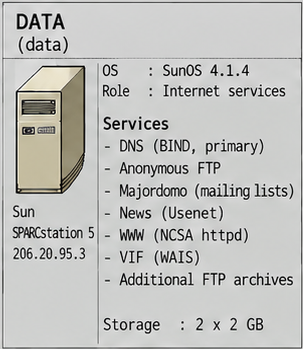

🇮🇹 **Italiano** · [🇬🇧 English](README.en.md)

# Server DATA

> **Internet Force 1995–1996 Historical Archive**
> Ricostruzione e documentazione tecnica basate sui materiali originali Internet Force conservati da Marco Iannacone.
> Autore e curatore dell'archivio: Marco Iannacone · https://pippo.com
> Licenza: [CC BY 4.0](../../LICENSE)

DATA era l'host dei servizi pubblici al centro della rete: risoluzione dei
nomi, FTP anonimo, news Usenet, mailing list e i principali contenuti web e host
virtuali.

*Ritaglio da [`images/internetforce_server_map.png`](../../images/internetforce_server_map.png) (Systems Overview 1995).*

## Piattaforma

- Sun SPARCstation 5, SunOS 4.1.4, 64 MB di RAM.
- Indirizzo `206.20.95.3`, sul proprio segmento firewall via `fw-data`
  (`206.20.95.10`).
- Nameserver primario (`dns`, `206.20.95.3`).

## Ruoli

### DNS (primario)

DATA era il primario autoritativo per `internetforce.com`, `intf.com`,
`internetforce.it` e i domini clienti/virtuali ospitati. Eseguiva BIND 4 e
generava le zone con il tooling `makezones`. Vedi [DNS](../../docs/03-dns.md).

### FTP anonimo

DATA gestiva il servizio FTP pubblico sotto `/usr/local/ftp`, con un `/pub` solo
download, un'area separata solo upload e un account anonimo in chroot che usava
Wu-ftpd e la shell `/ftponly`. Vedi
[Web, FTP, news e mailing list](../../docs/05-web-news-ftp.md).

### News Usenet

DATA serviva le news Usenet, alimentate dal server upstream `news.ios.com`. La
rule base di FireWall-1 registra quel feed (`news.ios.com -> data : nntp`).

### Web e host virtuali

DATA serviva `www1.intf.com` e i siti web virtuali dei clienti tramite lo schema
di indirizzi VIF (`www.20` … `www.35` nel DNS). Al lancio il server web era NCSA
HTTPd, poi sostituito da Apache. Vedi
[Web, FTP, news e mailing list](../../docs/05-web-news-ftp.md).

Fra gli host virtuali c'era anche `pointest.com`, il dominio associato al POP di
Gorgonzola, che nella fase iniziale era servito centralmente da DATA ma successivamente è stato reso autonomo da Marco; esponeva i
servizi CGI `Count.cgi` (contatore) e `cgiemail` (form di contatto). Lo snapshot
del sito personale
[`pippo.com` del 1997](../../systems/marco/personal-web/pippo.com-1997/README.md)
usa proprio quei servizi CGI e collega l'hosting virtuale dell'ISP a un reperto
Web concreto.

### Mailing list

Majordomo girava su DATA e ospitava le liste `intf-list`, `coach`, `marketing-l`
(con digest) e `cosmo-answer`, con archivi HTML.

## Storage

Il server usava il disco di sistema più tre dischi SCSI da ~2 GB con ruoli
designati: NEWS, HTTP e capacità futura di riserva. Gli alberi FTP anonimo e web
vivevano su questi dischi.

## Servizi e configurazione

| Servizio / ruolo | Descrizione | Configurazione / evidenza | Documentazione |
|---|---|---|---|
| DNS primario (BIND 4) | Nameserver autoritativo per i domini Internet Force e ospitati. | [`dns/named.boot`](dns/named.boot) · [`dns/named-data/`](dns/named-data/) · [`dns/`](dns/README.md) | [DNS](../../docs/03-dns.md) |
| FTP anonimo | Archivio FTP pubblico in chroot (Wu-ftpd, shell `/ftponly`). | [`system/inetd.conf`](system/inetd.conf) · [`../users/system/ftp-world.txt`](../users/system/ftp-world.txt) · [`../users/system/ftpusers`](../users/system/ftpusers) | [Web, FTP, news e mailing list](../../docs/05-web-news-ftp.md) |
| Majordomo | Liste di distribuzione con archivi HTML. | [`majordomo/`](majordomo/README.md) | [Liste di distribuzione](../../docs/20-mailing-lists-majordomo.md) |
| Proxy cache (CERN httpd 3.0) | Proxy HTTP con cache, in ascolto sulla porta 8090. | [`proxy-server/`](proxy-server/README.md) · [`CERN3-Proxy_installation.txt`](proxy-server/CERN3-Proxy_installation.txt) | [Web, FTP, news e mailing list](../../docs/05-web-news-ftp.md) · [Inventario software](../../docs/11-software-inventory.md) |
| News Usenet | Servizio news alimentato da `news.ios.com` (NNTP). | *nessuna configurazione recuperata* (la regola FireWall-1 documenta il feed) | [Web, FTP, news e mailing list](../../docs/05-web-news-ftp.md) |
| WWW / NCSA httpd | Server web e host virtuali dei clienti. | [`web/httpd.conf`](web/httpd.conf) · [`web/`](web/README.md) | [Web, FTP, news e mailing list](../../docs/05-web-news-ftp.md) |
| Hosting virtuale (VIF) | Indirizzi dedicati per sito tramite Virtual Interface su SunOS. | [`../sun-vif/`](../sun-vif/README.md) · [`dns/new_dns-HOWTO.txt`](dns/new_dns-HOWTO.txt) | [Web, FTP, news e mailing list](../../docs/05-web-news-ftp.md) |
| Archivi FTP aggiuntivi | Mirror e archivi pubblici aggiuntivi. | [`../../artifacts/scripts/automatic_mirror-HOWTO.txt`](../../artifacts/scripts/automatic_mirror-HOWTO.txt) | [Web, FTP, news e mailing list](../../docs/05-web-news-ftp.md) |

> Il WAIS compare fra i servizi storici di DATA; per il materiale VIF/WAIS il
> riferimento è [`../sun-vif/`](../sun-vif/README.md). Non viene forzato alcun
> collegamento a configurazioni inesistenti.

## Contenuti correlati in quest'area

- `dns/` — configurazione e zone del nameserver primario.
- [`mail/`](mail/README.md) — posta e ruolo di MX secondario di DATA.
- [`ftp/`](ftp/README.md) — area FTP anonimo e package storici conservati (la configurazione è in `system/inetd.conf`).
- `majordomo/` — configurazione e procedure delle mailing list.
- `news/` — materiale sulle news Usenet (nessuna configurazione recuperata).
- `web/` — configurazione del server web e materiale sugli host virtuali.
- `system/` — configurazione `/etc`, `inetd` (FTP anonimo) e avvio.

---

Vedi anche: [Panoramica dell'architettura](../../docs/01-architecture.md) ·
[Server USERS](../users/README.md)
