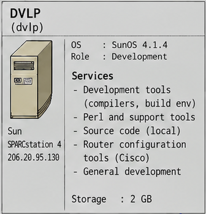

[🇮🇹 Italiano](README.md) · 🇬🇧 **English**

# DVLP — development and build host

> **Internet Force 1995–1996 Historical Archive**
> Historical reconstruction and technical documentation based on original Internet Force materials preserved by Marco Iannacone.
> Author and archive curator: Marco Iannacone · https://pippo.com
> License: [CC BY 4.0](../../LICENSE)

DVLP was the machine where software and configuration were compiled and tested before
being installed on the production servers. Keeping it separate was a
deliberate part of the security design.

*Crop from [`images/internetforce_server_map.png`](../../images/internetforce_server_map.png) (Systems Overview 1995).*

## Platform

- Sun SPARCstation 4, SunOS 4.1.4, 32 MB RAM.
- Address `206.20.95.130`, on the office LAN. It was **not** on a dedicated
  firewall segment and was **not** the planned SHELL host.
- A CD-ROM drive and a SCSI disk; the tape drive used for backups was
  attached here.

## Role

DVLP was the build and staging machine:

- source and software were obtained from the Internet/FTP sites of the
  period and built locally on DVLP;
- `/cisco` stored the router configurations;
- web content was tested here before release to USERS or DATA;
- only the required runtime components were transferred to production.

Production servers therefore kept a minimal software set - compilers and
development tools stayed on DVLP.

## Transfer and access

Software and files moved to the production hosts over the internal FTP
service in the first phase, with **SSH/SCP** added in 1996 as secure
replacements. DVLP's own FTP service was restricted to the office network.

## Router configurations

DVLP's `/cisco` directory is where the Cisco configurations were kept. The
canonical published copies live with the relevant systems -
[the uplink](../cisco-2501-uplink/README.en.md) and
[the POPs](../pops/README.en.md) - so the repository keeps a single home for
each configuration.

## Tape backup (DAT)

DVLP was also the operational point for backups. A **DAT** drive attached to
DVLP was used for the tape copies of the central systems (`/dev/rst0`, or
`/dev/nrst0` to append without rewinding). The production hosts - DATA, USERS
and FIREWALL - were read over the internal network and written to tape from
here; this is why DVLP was also the central `loghost`.

The full procedure (`gtar`/`dump`, restore, boot order) is in
[Operations and backup](../../docs/14-operations-and-backup.en.md); the
provenance of the tapes and the 2026 recovery is in
[Archive provenance](../../docs/archive-provenance.en.md). The DAT role is
summarised in [`BACKUP.en.md`](BACKUP.en.md).

The operational tapes belonged to Internet Force and remained with the company.
A separate cassette, containing a copy of the `marco` workstation, was kept
by Marco and recovered in 2026 with a compatible DAT drive;
unfortunately only part of the recovered Sun archives turned out to be partially readable.

## Services and configuration

| Service / role | Description | Configuration / evidence | Documentation |
|---|---|---|---|
| Development and build host | Software preparation and compilation before production. | *described in this README* | [Development](../../docs/07-development.en.md) |
| Compilers and build environment | Toolchain kept off the production servers. | *no recovered configuration* | [Development](../../docs/07-development.en.md) · [Software inventory](../../docs/11-software-inventory.en.md) |
| Perl and support tools | Operational and provisioning scripts. | [`../../artifacts/scripts/expire.pl`](../../artifacts/scripts/expire.pl) · [`../../artifacts/scripts/`](../../artifacts/scripts/README.en.md) · [`../../artifacts/tools/`](../../artifacts/tools/README.en.md) | [Development](../../docs/07-development.en.md) |
| Local source code | General development area on `/cisco` and around it. | *no source archive published* | [Development](../../docs/07-development.en.md) |
| Router configuration tools | Storage of the Cisco configurations and the new-POP procedure. | [`../pops/CISCO-add_new_pop-HOWTO.txt`](../pops/CISCO-add_new_pop-HOWTO.txt) · [`../pops/`](../pops/README.en.md) | [Router and WAN](../../docs/16-router-and-wan.en.md) |
| Deployment and system changes | Changes prepared here and applied to the production hosts. | [`../../artifacts/scripts/system.modification-after_OSINSTALLATION.txt`](../../artifacts/scripts/system.modification-after_OSINSTALLATION.txt) | [Development](../../docs/07-development.en.md) |
| DAT tape backup and `loghost` | Operational point for the central-system backups. | [`BACKUP.en.md`](BACKUP.en.md) | [Operations and backup](../../docs/14-operations-and-backup.en.md) |

> Historical note: DVLP was the Sun development/build host; the Linux `marco`
> workstation was for experimentation, administration and testing. **A Linux →
> SunOS cross-compilation was not part of the operational workflow.**

## Historical Unix and security tools

This area preserves two recovered third-party packages from the Unix/SunOS
environment:

| Software | Version | File | Role |
|---|---|---|---|
| chrootuid | 1.2 | [chrootuid1.2.shar.Z](chrootuid1.2.shar.Z) | Runs a program under a reduced user identity and inside a `chroot`. **The recovered archive is 0 bytes: its content did not survive.** |
| COPS | ~1992, local configuration 1996 | [cops-perl.intf.tar.z](cops-perl.intf.tar.z) | Third-party Unix security-checking software, in a locally configured installation. |

**chrootuid 1.2** — the package is used to run a service or process in a
restricted (`chroot`) environment under a specified user identity. It was used
on users and data for all services such as web and ftp servers and for user home
directories; the recovered archive is in any case empty (0 bytes), so its
content is not available.

**COPS** — COPS (Computer Oracle and Password System) is third-party Unix
security-auditing software; it was **not** developed by Internet Force and was
**not** part of Check Point FireWall-1. The archive represents a locally
configured COPS installation and also contains local configuration (`cops.cf`,
`cops.cf.orig`). It is third-party software under its own licence.

## Related content in this area

- `build/` — build and source-management area (no recovered files).
- [`BACKUP.en.md`](BACKUP.en.md) — DVLP and DAT backups (summary and links).

---

See also: [Development](../../docs/07-development.en.md) ·
[Operations and backup](../../docs/14-operations-and-backup.en.md) ·
[Archive provenance](../../docs/archive-provenance.en.md)
