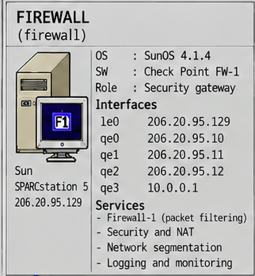

[🇮🇹 Italiano](README.md) · 🇬🇧 **English**

# Firewall

> **Internet Force 1995–1996 Historical Archive**
> Historical reconstruction and technical documentation based on original Internet Force materials preserved by Marco Iannacone.
> Author and archive curator: Marco Iannacone · https://pippo.com
> License: [CC BY 4.0](../../LICENSE)

The security gateway (Firewall) protected the central servers and the office LAN. Its
purpose was to control access to the machines that exposed services - DATA,
USERS and the planned SHELL, plus the office network - each with its own
policy on its own interface. Dial-up customers were on the world/backbone
side and were not the object of the firewall's protection: a dial-up user
runs no services and therefore needs no protection.

*Crop from [`images/internetforce_server_map.png`](../../images/internetforce_server_map.png) (Systems Overview 1995).*

## Firewall-1: when the firewall began to understand connections

To understand how advanced the adoption of Check Point FireWall-1 was in 1995, it is useful to remember how young the commercial firewall market still was.

The first generations of firewalls mainly followed two approaches. The first was **packet filtering**: routers and gateways decided whether to accept or discard each packet based on elements such as IP address, protocol and port number. It was a relatively simple form of control and, above all, it had no knowledge of the conversation to which that individual packet belonged.

A second approach relied on **application proxies**. The firewall terminated the connection coming from one network and opened a new one toward the other, using protocol-specific proxies for services such as FTP, SMTP or HTTP. In the early 1990s, products such as DEC SEAL contributed to the emergence of the commercial firewall market; shortly afterwards, the Firewall Toolkit developed by Trusted Information Systems and made available to the Internet community by Marcus Ranum brought this model into the world of application proxies. Its code would later become the basis for the commercial TIS Gauntlet firewall.

Check Point introduced a different approach. Founded in 1993, the company developed the technology it called **Stateful Inspection** and introduced FireWall-1 in 1994.

The idea was as easy to explain as it was important in its consequences: the firewall no longer had to evaluate each packet as if it had no memory of what had happened before. Instead, it maintained information about the **state of connections**, allowing it to recognise whether a packet belonged to an already authorised session and to apply policy in the context of the overall communication.

This approach combined some of the flexibility of packet filtering with an awareness of connection state that static filters did not have, without necessarily requiring a separate application proxy for every protocol.

By 1995, FireWall-1 had therefore been commercially available for only about a year. Finding it in the architecture of a small Italian ISP does not simply mean finding "a firewall": it documents the very early adoption of a technology that would become one of the fundamental principles of modern network firewalls.

## Platform

- Sun SPARCstation 5, SunOS 4.1.4, 32 MB RAM.
- **Check Point FireWall-1 2.0a**, administered through its X11 GUI.
- Five Ethernet interfaces:

| Interface | Name | Address | Netmask | Role |
|---|---|---|---|---|
| `qe3` | fw-world | 10.0.0.1 | 255.0.0.0 | backbone / World Hub |
| `qe0` | fw-data | 206.20.95.10 | 255.255.255.192 | DATA segment |
| `qe1` | fw-users | 206.20.95.11 | 255.255.255.192 | USERS segment |
| `qe2` | fw-shell | 206.20.95.12 | 255.255.255.192 | planned SHELL segment |
| `le0` | office | 206.20.95.129 | 255.255.255.128 | office LAN |

The firewall had two network cards. The onboard `le0` (AMD Lance) connected
the office LAN. The **Sun Quad Ethernet card** provided the four `qe`
interfaces: the world/backbone side (`qe3`) plus a separate interface for
each server segment - DATA (`qe0`), USERS (`qe1`) and the planned SHELL
(`qe2`). Each server therefore faced the firewall on its own interface and
was governed by its own policy, which is exactly what the recovered rule
base shows. The segmentation was physical, not just logical.

## Routing

`/etc/rc.route` configured the interfaces and built host-specific routes. On
the DATA and USERS interfaces it deleted the broad connected route and added
one route per server, enforcing the segmented design at layer 3. The default
route pointed at the central Cisco 2501 (`intf-idt`, `10.0.1.1`), which is
how the protected servers reached the Internet; routes for the POP networks
pointed at their respective POP routers on the world side. Dial-up sessions
travelled over the world/backbone and did not depend on the firewall for
Internet access.

## The rule base

The original FireWall-1 screenshot (`/usr/local/etc/fw/conf/final1.W`) is
preserved in the archive. The 15 rules are listed in
[Security](../../docs/06-security.en.md). In summary:

- universal permit for DNS and ident;
- public access to the servers' web/ICMP/SMTP services;
- full access within the `intf.com` namespace;
- customer and office access to FTP, news, POP2/POP3;
- access-server authentication (rule 7, `ts -> users : tacacs`) to USERS;
- administration from DVLP and Marco's workstation, including the
  FireWall-1 management and logging channels and X11;
- the upstream news feed (rule 12, `news.ios.com -> data : nntp`) from `news.ios.com` to DATA;
- remote support (rule 13, `xpert.com -> dvlp, marco : talk, deslogin`) from `xpert.com` to DVLP and Marco;
- a final `Any -> Any : Any : STOP` rule dropping everything else.

Rules 8 and 9 (`ts -> Shell`, `Shell -> users : NFS`) belong to the planned
SHELL host that was never deployed.

## Administration

The firewall was administered from inside the protected office network. Rule
11 permits DVLP to reach the firewall by telnet and on the FireWall-1
management (`FW1`) and logging (`FW1_log`) channels; rule 14
(`dvlp, marco -> marco, dvlp : X11`) lists both DVLP and Marco's workstation as
sources and as destinations, so it allowed X11 traffic between the two. Rule 10
grants DVLP and Marco telnet access to the servers.
The management traffic never crossed the public Internet.

## Services and configuration

| Service / role | Description | Configuration / evidence | Documentation |
|---|---|---|---|
| FireWall-1 2.0a | Security gateway: packet filtering, NAT and network segmentation. | [`checkpoint/firewall-lic.txt`](checkpoint/firewall-lic.txt) · [`checkpoint/`](checkpoint/README.en.md) | [Security](../../docs/06-security.en.md) · [`TECHNICAL.en.md`](TECHNICAL.en.md) |
| Policy / rule base — visual evidence | Original Rule Base Editor screenshot (`/usr/local/etc/fw/conf/final1.W`), 15 rules. | [`checkpoint/FW-policy.gif`](checkpoint/FW-policy.gif) | [Security](../../docs/06-security.en.md) |
| Routing and interfaces | Five Ethernet interfaces, host-specific routes on the DATA/USERS segments, POP routes. | [`network/rc.route`](network/rc.route) · [`network/`](network/README.en.md) | [Architecture overview](../../docs/01-architecture.en.md) |
| Startup, logging and monitoring | FireWall-1 startup (`fwstart`), dial-up accounting, central `loghost`. | [`network/rc.local`](network/rc.local) | [Monitoring](../../docs/08-monitoring.en.md) |
| System hardening | Permission script, service accounts, minimal `inetd`, `ftpusers`. | [`system/`](system/README.en.md) · [`system/fixperms`](system/fixperms) · [`../users/system/ftpusers`](../users/system/ftpusers) | [Security](../../docs/06-security.en.md) |

### Visual policy evidence

[`checkpoint/FW-policy.gif`](checkpoint/FW-policy.gif) is the original
Check Point FireWall-1 Rule Base Editor screenshot: it is **visual evidence** of
the loaded policy, preserved as a historical artifact. It does not replace the
textual transcript of the rules in [Security](../../docs/06-security.en.md),
which remains the primary source.

## Related content in this area

- `checkpoint/` — FireWall-1 configuration and policy material.
- `network/` — routing and network-configuration material for the gateway.

The original rule base screenshot itself is held with the recovered
reference material; see [Security](../../docs/06-security.en.md).

---

See also: [Architecture overview](../../docs/01-architecture.en.md) ·
[NIS/NFS non-use](../../docs/06-security.en.md)
