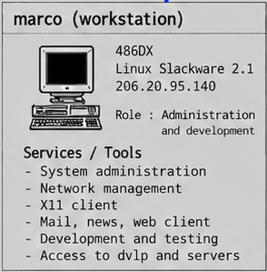

🇮🇹 **Italiano** · [🇬🇧 English](README.en.md)

# La workstation `marco`

> **Internet Force 1995–1996 Historical Archive**
> Ricostruzione e documentazione tecnica basate sui materiali originali Internet Force conservati da Marco Iannacone.
> Autore e curatore dell'archivio: Marco Iannacone · https://pippo.com
> Licenza: [CC BY 4.0](../../LICENSE)

*Ritaglio da [`images/internetforce_server_map.png`](../../images/internetforce_server_map.png) (Systems Overview 1995).*

La workstation Linux di Marco Iannacone è la macchina personale e operativa al
centro di questa area. La sua storia è più ampia del solo ruolo nella LAN
dell'ufficio: fu la macchina di amministrazione e lavoro tecnico durante Internet
Force, il luogo in cui furono conservati materiali tecnici e personali, e
successivamente fu usata anche nel periodo di transizione dopo Internet Force.

## Piattaforma

- PC di classe 486DX con IP `206.20.95.140`, sulla LAN dell'ufficio.
- Linux (Slackware 2.1) con X11; 16 MB di RAM e 1 GB di disco SCSI.
- Introdotta su suggerimento di **Yahel Ben-David** (Xpert UNIX Systems) come
  ambiente sicuro in cui imparare Unix/Linux sperimentando.

## Ruolo operativo

- nacque come **ambiente deliberatamente sacrificabile**, separato dai server
  Sun di produzione: Marco poteva modificarlo, romperlo o reinstallarlo da zero
  per imparare, senza rischiare l'infrastruttura dell'ISP;
- divenne poi la workstation quotidiana di amministrazione, test e monitoraggio
  (tkined/SNMP), e ospitò l'uso personale di PGP e copie occasionali di lavoro,
  inclusi snapshot irregolari di Hypertxt;
- durante la chiusura di Internet Force fu riconfigurata come server che rese possibile
 la continuità operativa nella migrazione verso Enter (divenne il server con a bordo sia
 le funzionalità di USERS che quelle di DATA) .

Lo sviluppo destinato ai server Sun restava nell'ambiente Sun (DVLP): **non
faceva parte del flusso operativo una cross-compilazione Linux → SunOS**. Vedi
[Sviluppo e l'host di build](../../docs/07-development.md).

## Sezioni di questa area

| Sezione | Contenuto |
|---|---|
| [`system/`](system/) | Configurazione della macchina: script di avvio `rc.*` dell'era Slackware, `sendmail.cf.linux`, partizionamento del disco. |
| [`pgp/`](pgp/) | Public keyring PGP di Marco e il package storico PGP 2.6.3i. |
| [`reference-material/xpert/`](reference-material/xpert/) | Materiale di riferimento raccolto da Marco presso Xpert UNIX Systems (Tel Aviv, 1995). |
| [`hypertxt/`](hypertxt/) | Materiale recuperato del prodotto di authoring Hypertxt e provenienza. |
| [`personal-web/`](personal-web/) | Snapshot del sito personale di Marco, `pippo.com` (1997). |
| [`defcon-v-1997/`](defcon-v-1997/) | Archivio personale successivo a Internet Force (articolo DEFCON V, 1997). |

## Fotografia storica dell'ufficio

Una fotografia storica dell'ufficio Internet Force è conservata in
[`artifacts/photographs/internetforce-office-1995.jpg`](../../artifacts/photographs/README.md).

## Ruolo nella LAN dell'ufficio

Nella rete dell'ufficio `marco` era la postazione dell'amministratore; la LAN
continua a documentarlo come host del segmento in
[La LAN dell'ufficio](../office-lan/README.md).

## pippo.com e la presenza Web personale

`pippo.com` era il **sito personale di Marco Iannacone**. Lo snapshot Web del
1997 è conservato in
[`personal-web/pippo.com-1997/`](personal-web/pippo.com-1997/README.md).

Il sito era storicamente raggiungibile attraverso l'hosting di pippo.com su server Internet Force, e la
stessa presenza personale era raggiungibile anche come area `/~ianna/` sui
domini Internet Force.

## Materiali e attività associati

Materiale storico collegato alla workstation o al lavoro tecnico di Marco,
**distinto dai servizi in esecuzione sulla macchina**. La scheda rappresenta
l'ambiente del **1995**: parte del materiale è successiva e va letto con la data
indicata.

| Materiale | Data / contesto | Descrizione | Collegamento |
|---|---|---|---|
| Guida a Internet / Hypertxt | 1994–1997 | Guida ipertestuale a Internet di Marco Iannacone (MaISoft Hypertxt). | [`hypertxt/`](hypertxt/README.md) |
| PGP | chiavi del 1995-09-17 e 1995-10-11 | Uso personale di PGP, con il keyring pubblico recuperato e il package storico PGP 2.6.3i. | [`pgp/`](pgp/README.md) |
| pippo.com e presenza Web personale | snapshot 1997 | Sito personale di Marco, ospitato sull'infrastruttura Internet Force. | [`personal-web/pippo.com-1997/`](personal-web/pippo.com-1997/README.md) |
| Easy! (Welcome Kit) | 1996 | Programma cliente del Welcome Kit, realizzato da Marco Iannacone. | [`artifacts/customer-welcome-kit/`](../../artifacts/customer-welcome-kit/README.md) |
| Monitoraggio tkined / SNMP | 1995 | Mappa di rete creata dalla workstation Linux/X e file SNMP recuperati. | [`artifacts/tkined/`](../../artifacts/tkined/README.md) |
| DEFCON V (articolo) | 1997 — **successivo a Internet Force** | Articolo sull'incontro DEFCON V di Las Vegas, recuperato dal backup DAT della workstation. | [`defcon-v-1997/`](defcon-v-1997/README.md) |

**Cronologia.** DEFCON V è materiale **del 1997**, successivo alla fase operativa
di Internet Force.

## Contenuti correlati

- [`system/`](system/) — script di avvio e configurazione della macchina.
- [`reference-material/xpert/`](reference-material/xpert/README.md) — materiale Xpert.
- [`artifacts/photographs/`](../../artifacts/photographs/README.md) — fotografia storica dell'ufficio.

---

Vedi anche: [Sviluppo e DVLP](../../docs/07-development.md) ·
[Note storiche](../../docs/09-historical-notes.md) ·
[Monitoraggio](../../docs/08-monitoring.md) ·
[Provenienza dell'archivio](../../docs/archive-provenance.md)
