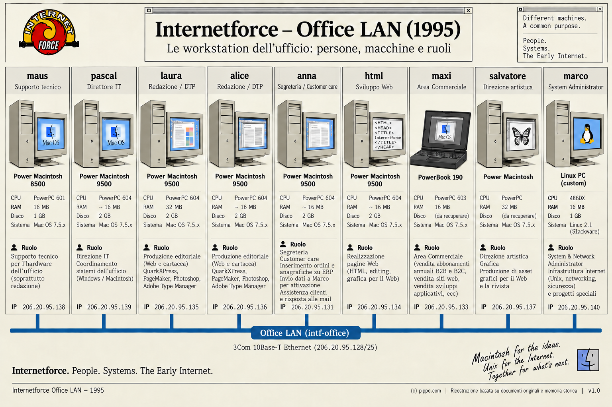

[🇮🇹 Italiano](README.md) · 🇬🇧 **English**

# Office LAN

> **Internet Force 1995–1996 Historical Archive**
> Historical reconstruction and technical documentation based on original Internet Force materials preserved by Marco Iannacone.
> Author and archive curator: Marco Iannacone · https://pippo.com
> License: [CC BY 4.0](../../LICENSE)

The Milan office had its own network behind the firewall's office interface,
separate from the backbone and the server segments.

*Complete image [`images/internetforce_office_lan.png`](../../images/internetforce_office_lan.png) (Office LAN 1995). Documentary: no workstation is interactive.*

The office (`intf-office`, `206.20.95.128/25`) was a mixed Macintosh and
Unix/Linux working environment behind the firewall's office interface: editorial
and DTP on Macs, the sales area, web authoring and technical administration on
Linux ([`marco` workstation](../marco/README.en.md)). The image documents people,
workstations and roles; it is **not interactive** and there are no pages for the
individual workstations.

A historical photograph of the office is preserved in
[`artifacts/photographs/`](../../artifacts/photographs/README.en.md).

## Network

- `206.20.95.128/25`, the top half of the `206.20.95.0/24` Milan block.
- Firewall office interface `le0`: `206.20.95.129`.
- Office hub: a **3Com LinkBuilder FMS** (LinkBuilder FMS II, model 3C16670)
  at `206.20.95.254` — a shared 10Base-T collision domain, not a switch.
- The office used Allied Telesyn AUI/10BaseT micro-transceivers to attach
  equipment to the hub.

## Attached systems

The office segment carried the development and administrative machines and
the desktop computers:

| Host | Address | Notes |
|---|---|---|
| `firewall` (office iface) | 206.20.95.129 | gateway for the segment |
| `dvlp` | 206.20.95.130 | development/build host |
| `anna` | 206.20.95.131 | administration / customer care |
| `franz` | 206.20.95.132 | office workstation (commercial management) |
| `maxi` | 206.20.95.133 | office workstation (sales) |
| `html` | 206.20.95.134 | web-content workstation |
| `laura` | 206.20.95.135 | editorial / DTP |
| `alice` | 206.20.95.136 | editorial / DTP |
| `salvatore` | 206.20.95.137 | art direction / graphics |
| `maus` | 206.20.95.138 | hardware support |
| `pascal` | 206.20.95.139 | IT management |
| `marco` | 206.20.95.140 | administrator workstation |
| `PcDemo` | 206.20.95.141 | demo PC |
| `oracolo` | 206.20.95.142 | [later database/web host](../oracolo/README.en.md) |

`anna` covered **administration** and **customer care**: she received orders
from the sales area, entered orders and customer records into the management
system, sent Marco the data required for technical account activation, and
answered customer requests, including by email.

Office machines were a mix of PCs and Macs, typical of a mid-1990s Italian
office. Marco's workstation (`marco`) used Slackware Linux 2.1 with X11 and was the
administration and monitoring station.

## Alternative names in the recovered material

The recovered DNS and `/etc/hosts` snapshots also label some office addresses
with additional or alternative names, including `aps`, `cust2` and `isa`. These
are treated as a **historical naming layer** present in the recovered
configuration material, not as the machines' primary names and not as
replacements for the nomenclature used in the reconstruction.

`aps` was the name of Pascal's personal company / VAT entity: this makes its
appearance in the historical material meaningful, but the repository does
**not** infer or assert a one-to-one mapping between those names and specific
hosts or addresses.

The reader-facing nomenclature of the reconstruction (`laura`, `alice`,
`salvatore`, `maus`, `pascal`, and the others) is the one kept; the
organisational context is in the
[People, machines and workflows](../../docs/15-people-and-workflows.en.md) page.

## Management

The office hub was monitored over SNMP by tkined (it appears in the
recovered map with an interface-load stripchart), and the office network was
the protection perimeter from which the firewall GUI and the servers were
administered. FireWall-1 rules 10, 11 and 14 express the administrative and
X11 paths from this segment.

## UPS

A UPS protected the central equipment on the backbone side and was monitored
for reachability from tkined.

---

See also: [Architecture overview](../../docs/01-architecture.en.md) ·
[The firewall](../firewall/README.en.md) ·
[Monitoring](../../docs/08-monitoring.en.md)
