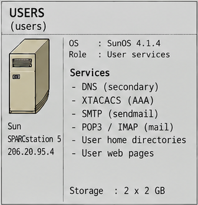

🇮🇹 **Italiano** · [🇬🇧 English](README.en.md)

# Server USERS

> **Internet Force 1995–1996 Historical Archive**
> Ricostruzione e documentazione tecnica basate sui materiali originali Internet Force conservati da Marco Iannacone.
> Autore e curatore dell'archivio: Marco Iannacone · https://pippo.com
> Licenza: [CC BY 4.0](../../LICENSE)

USERS era uno dei due server di produzione centrali e quello con cui i clienti
interagivano di più. Gestiva autenticazione, posta e account dei clienti.

*Ritaglio da [`images/internetforce_server_map.png`](../../images/internetforce_server_map.png) (Systems Overview 1995).*

## Piattaforma

- Sun SPARCstation 5, SunOS 4.1.4, 64 MB di RAM.
- Indirizzo `206.20.95.4`, sul proprio segmento firewall via `fw-users`
  (`206.20.95.11`).
- Mail host per `internetforce.com` (MX 0); name server secondario (`dns2`).

## Ruoli

### Autenticazione (XTACACS)

USERS eseguiva `xtacacsd` come servizio di autenticazione centrale per ogni POP
dial-up. Ogni access server Cisco puntava a `206.20.95.4`. XTACACS manteneva
anche record di login per ogni access server ai fini dell'accounting. Vedi
[Autenticazione](../../docs/10-authentication-tacacs.md).

### Posta

Sendmail 8.6.12 forniva SMTP; il Berkeley `popper` serviva POP3 e `imapd`
serviva IMAP. La posta dei clienti era consegnata a un `.mailbox` per utente
nella home directory. Vedi [Posta elettronica](../../docs/04-email.md).

### DNS

USERS era il name server secondario (`dns2`) per tutte le zone Internet Force,
trasferendole da DATA.

### Home e web dei clienti

Gli account dei clienti vivevano sotto `/users/01/<login>/home`. Ogni account
aveva un ambiente con shell ristretta e, quando serviva, una directory
`public_html` servita come spazio web personale. Le quote disco erano applicate
sui filesystem dei clienti. Vedi
[Provisioning dei clienti](../../docs/12-customer-provisioning.md).

Fra le pagine personali ospitate c'erano anche lo spazio `/~ianna/` e il sito
personale di Marco Iannacone `pippo.com`, servito come host virtuale da USERS:
la configurazione HTTPd recuperata contiene un `VirtualHost` per
`www.pippo.com`. Lo snapshot del 1997 è conservato in
[`systems/marco/personal-web/pippo.com-1997/`](../../systems/marco/personal-web/pippo.com-1997/README.md).

## Servizi avviati da `inetd`

L'`inetd.conf` recuperato mostra i servizi offerti da USERS: telnet, ident,
shell/rsh, login/rlogin, FTP, finger e i due protocolli di accesso alla posta
(`imapd` e il `popper`). I demoni `inetd` erano avvolti con `tcpd` (TCP
wrappers) per controllo degli accessi e logging.

## Storage

Il server usava il disco di sistema più dischi SCSI aggiuntivi esportati come
filesystem degli account clienti (`/usr/export/sd1c`, `/usr/export/sd2c`), con
le quote abilitate. Un terzo disco era riservato a capacità futura.

## Servizi e configurazione

| Servizio / ruolo | Descrizione | Configurazione / evidenza | Documentazione |
|---|---|---|---|
| DNS secondario (`dns2`) | Nameserver secondario per le zone Internet Force, trasferite da DATA. | *nessuna configurazione specifica di USERS recuperata* | [DNS](../../docs/03-dns.md) |
| XTACACS / AAA | Autenticazione centralizzata di ogni access server dial-up. | [`tacacs/xtacacsd-conf`](tacacs/xtacacsd-conf) · [`tacacs/`](tacacs/README.md) | [Autenticazione (XTACACS)](../../docs/10-authentication-tacacs.md) |
| SMTP / sendmail | Mail host primario per `internetforce.com` (MX 0), Sendmail 8.6.12. | [`mail/sendmail.cf.users`](mail/sendmail.cf.users) | [Posta elettronica](../../docs/04-email.md) |
| POP3 | Accesso alle mailbox tramite Berkeley `popper`. | [`system/inetd.conf`](system/inetd.conf) · [`system/services`](system/services) | [Posta elettronica](../../docs/04-email.md) · [POP3 e mailbox](../../docs/18-pop3-and-mailbox-access.md) |
| IMAP | Accesso alle mailbox tramite `imapd`. | [`system/inetd.conf`](system/inetd.conf) · [`system/services`](system/services) | [Posta elettronica](../../docs/04-email.md) |
| Home directory e quote dei clienti | Account, shell ristretta, quote disco e layout dei filesystem. | [`system/passwd.users-jan1995`](system/passwd.users-jan1995) · [`system/quota.txt`](system/quota.txt) · [`system/restricted-shell.txt`](system/restricted-shell.txt) · [`system/rc.local`](system/rc.local) | [Provisioning dei clienti](../../docs/12-customer-provisioning.md) · [Operazioni e backup](../../docs/14-operations-and-backup.md) |
| Pagine web dei clienti | NCSA HTTPd per `~utente` e per gli host virtuali. | [`system/httpd/`](system/httpd/) | [Web, FTP, news e mailing list](../../docs/05-web-news-ftp.md) · [Permessi web e CGI](../../docs/19-web-permissions-and-cgi.md) |

> Non esiste un file `named.boot` specifico di USERS nell'archivio pubblico: il
> ruolo di DNS secondario è documentato, non configurato qui. Il materiale delle
> zone secondarie si trova con il nameserver primario
> ([`../data/dns/`](../data/dns/README.md)).

## Contenuti correlati in quest'area

- `tacacs/` — demone XTACACS, configurazione e documentazione.
- `mail/` — configurazione Sendmail e materiale sugli alias di posta.
- `dns/` — area del name server secondario (nessuna configurazione specifica
  recuperata).
- `system/` — la configurazione `/etc` dell'host, il layout dei dischi e gli
  script di avvio.

---

Vedi anche: [La sessione dial-up](../../docs/02-dialup-session.md) ·
[Server DATA](../data/README.md)
